 

<h3><code>avi502@github ~ $ whoami</code></h3>

<!-- Portrait (optional): after running scripts/prep_photo.py + scripts/make_ascii_svg.py,
     replace the single  below with this table:

<table>
<tr>
<td valign="top"></td>
<td valign="top"></td>
</tr>
</table>
-->

 

 
 

<h3><code>avi502@github ~ $ cat about.txt</code></h3>

Hi, I'm <b>Avisekh Mondal</b> 👋 — B.Tech first-year student from Kolkata, passionate about coding 💻 
Building with <b>HTML · CSS · JavaScript · C · C++ · Python · Java</b> 
Currently learning <b>Linux &amp; Windows OS</b> and working toward open-source contributions.

 

<h3><code>avi502@github ~ $ ./neofetch.sh</code></h3>

 
 

 
 

<h3><code>avi502@github ~ $ ./contributions.sh</code></h3>

 
 

<h3><code>avi502@github ~ $ ./skills.sh</code></h3>

 
 

<h3><code>avi502@github ~ $ ./progress.sh</code></h3>

 
 

<h3><code>avi502@github ~ $ ./stack.sh</code></h3>

 

 

<h3><code>avi502@github ~ $ ./orbit.sh</code></h3>

 
 

<h3><code>avi502@github ~ $ ./projects.sh</code></h3>

 

[**GUESSING_GAME**](https://github.com/avi502/GUESSING_GAME) — C number-guessing game with hints, limited attempts, scoring and Hard Mode 
[**SIMPLE_CALCULATOR**](https://github.com/avi502/SIMPLE_CALCULATOR) — C++ calculator: arithmetic, power, root, trig, log, min/max

 

 

<h3><code>avi502@github ~ $ ./links.sh</code></h3>

 

